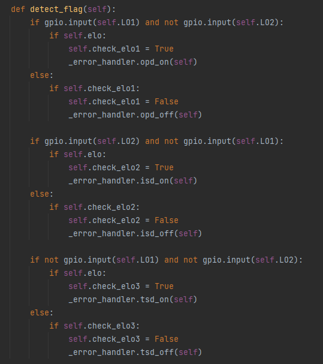
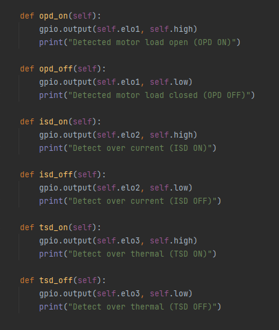

# How use this:
Download repository and import 'main' file

``
git clone https://github.com/BartoszKossowski/toshiba.git
``

Python3.x only

```python
from toshiba.main import TB67S249FTG
import time  # do i need to translate this library?

test = TB67S249FTG(2, 3, 4, 27, 22, 17, 14, 15, None, None, 21, 20, 16)

"""
what is what:

TB67S249FTG(
    DMODE0 = 2, # require
    DMODE1 = 3, # require
    DMODE2 = 4, # require
    CLK = 27, # require
    ENABLE = 22, # require
    DIR = 17, # require
    LO1 = 14, # require
    LO2 = 15, # require
    AGC0 = None, 
    AGC1 = None,
    ELO1 = 21, 
    ELO2 = 20,
    ELO3 = 16)
    
    The numbers are pins from the raspberry pi 4 platform (saved as BCM)
"""

# enable driver first
test.enable()

# set turning direction
test.turning_direction("CW")  # it is set automatically

# set resolution mode
test.mode("1/16")

for cycle in range(1000):
    test.up()  # CLK pin set high
    time.sleep(.0002)
    test.down()  # CLK pin set down
    
```

If there are any errors on pins LO1/LO2, then:





